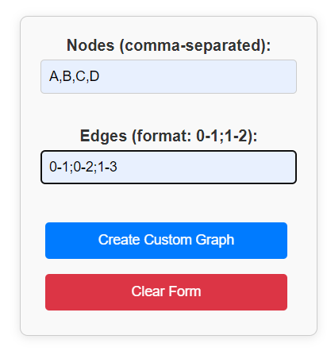
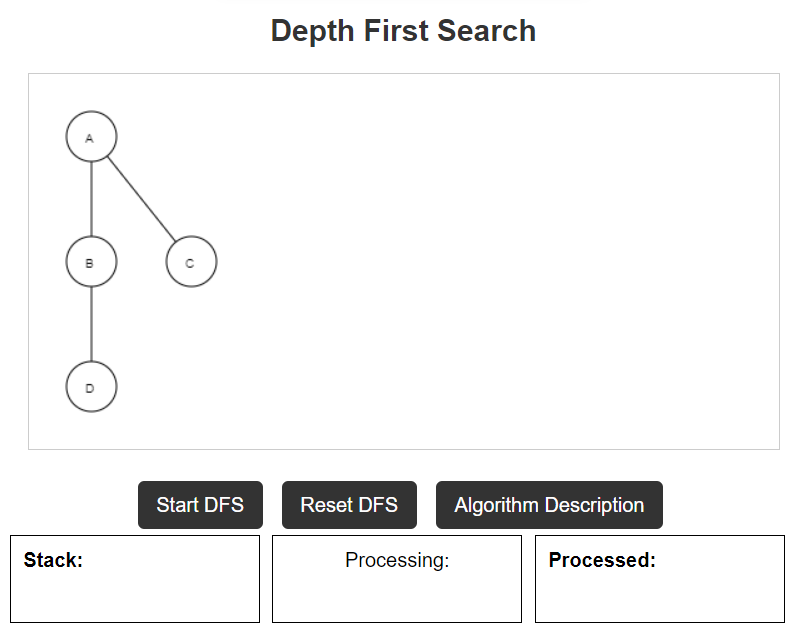

# 🧭 DFS-BFS Graph Traversal

This project implements **Depth-First Search (DFS)** and **Breadth-First Search (BFS)** algorithms for graph traversal. The backend includes user authentication functionality with a **Login** and **Signup** page. The project currently stores user data in **local storage**.

## 📑 Table of Contents

1. 🌟 [Features](#-features)
2. 🛠️ [Technical Stack](#-technical-stack)
3. 📝 [Changelog](#-changelog)
4. 📂 [Project Structure](#-project-structure)
5. ⚙️ [Prerequisites](#-prerequisites)
6. 🚀 [How to Set Up and Run the Project](#-how-to-set-up-and-run-the-project)
7. 🧪 [Testing Instructions](#-testing-instructions)
8. 🔐 [Login and Signup Pages](#-login-and-signup-pages)
9. 🖥️ [How the Server Works](#-how-the-server-works)
10. 📊 [Graph Feature](#-how-the-graph-feature-works)
11. 🗺️ [Roadmap](#-roadmap)
12. 🤝 [Contributing](#-contributing)
13. 👥 [Contributors](#-our-contributors)
---

## 🌟 Features

- 🔑 User **Login** and **Signup** system
- 🔍 DFS and BFS graph traversal algorithms
- 💾 Data persistence using **LocalStorage**
- 🖥️ Frontend built with **Angular**
- 🔧 Backend using **Node.js** with **Express.js**

---
## 🛠️ Technical Stack

| **Component**        | **Technology**                                                                 |
|----------------------|-------------------------------------------------------------------------------|
| **Frontend**         | Angular 🅰️                                                                    |
| **Backend**          | Node.js 🟢, Express.js ⚙️                                                    |
| **Authentication**   | LocalStorage 🔒 (with plans to integrate OAuth 🔑)                            |
| **Database**         | LocalStorage for user data 💾 (future plans for database integration 📊)      |
| **Graph Algorithms** | DFS and BFS implemented for traversal 📈                                      |
| **Deployment**       | Netlify configuration for frontend 🌐 
---

## 📝 Changelog

### Version 1.0.0 (Initial Release)
- Implemented **DFS** and **BFS** graph traversal algorithms. 🔍
- Added **Login** and **Signup** pages with user data stored in **LocalStorage**. 🔑
- Basic project structure setup with Angular for the frontend and Node.js/Express.js for the backend. 🏗️


---

## 📂 Project Structure

```bash
.vscode/                    # Contains workspace settings for VSCode
backend/                    # Backend directory (Node.js/Express)
public/                     # Public assets like images, logos, etc.
src/                        # Angular application source code
.editorconfig               # Editor configuration for consistent coding style
.gitignore                  # Git ignore file to exclude certain files from being committed
CODE_OF_CONDUCT.md          # Code of conduct for contributors
CONTRIBUTING.md             # Guidelines for contributing to the project
README.md                   # Project documentation file
angular.json                # Angular workspace configuration
netlify.toml                # Configuration for deploying to Netlify
package-lock.json           # Locked versions of installed npm dependencies
package.json                # Project metadata and npm dependencies
tsconfig.app.json           # TypeScript configuration for the app
tsconfig.json               # General TypeScript configuration
tsconfig.spec.json          # TypeScript configuration for testing
```

---

## ⚙️ Prerequisites

Make sure you have the following installed before running the project:

- 🟢 [Node.js](https://nodejs.org/en/download/) (v14 or above)
- 📦 npm (comes with Node.js)
- 🅰️ [Angular CLI](https://angular.io/cli) (globally installed)

---

## 🚀 How to Set Up and Run the Project

### 🛠️ Step 1: Clone the Repository

```bash
git clone https://github.com/yourusername/dfs-bfs-graph-traversal.git
cd GRAPH-TRAVERSAL
```

### 🛠️ Step 2: Install Frontend Dependencies

```bash
npm install
```

### 🛠️ Step 3: Navigate to Backend Directory and Install Backend Dependencies

```bash
cd backend
npm install
```

### 🛠️ Step 4: Run the Backend Server

From the `backend` directory, start the backend:

```bash
node server.js
```

Alternatively, you can use **nodemon** for automatic restarts:

```bash
npm install -g nodemon
nodemon server.js
```

### 🛠️ Step 5: Start the Frontend Server

Go back to the project root (`GRAPH-TRAVERSAL`) and run the Angular development server:

```bash
ng serve
```

Your frontend will be running at `http://localhost:5000` 🌐.

---

## 🧪 Testing Instructions

To ensure the reliability and functionality of the project, follow these testing instructions:

### Unit Testing

1. **Navigate to the frontend directory**:
   ```bash
   cd src
   ```
2. **Run the unit tests:**
   ```bash
   ng test
   ```
### End-to-End Testing

1. **Install Protractor (if not already installed)**:
   ```bash
   npm install -g protractor
   ```
2. **Start the Protractor server**:
   ```bash
   webdriver-manager update
   webdriver-manager start
   ```
3. **Run the end-to-end tests**:
   ```bash
   ng e2e
   ```
### Manual Testing

- After running the application, perform manual testing by interacting with the **Login** and **Signup** pages to ensure functionality.
- Test the **graph traversal features** by creating graphs with various nodes and edges, checking for expected behavior.

---

## 🔐 Login and Signup Pages

- The **Signup Page** allows users to register by entering a username and password, which is stored in **LocalStorage**.
- The **Login Page** checks credentials against the data stored in LocalStorage.

### 🛠️ How to Access Signup Details from LocalStorage

1. 🖱️ Right-click on the **Signup page** and select **Inspect**.
2. 🧰 Navigate to the **Application** tab in the developer tools.
3. 📂 Under **Storage**, expand **LocalStorage**.
4. 🔍 You’ll find the stored signup details there.

---

## 🖥️ How the Server Works

The backend server, built with **Node.js** and **Express.js**, handles:

- 🛡️ **User Authentication**: A basic registration and login system.
- 🔄 **Graph Traversal**: Provides APIs for DFS and BFS traversals.

## 📊 How the Graph Feature Works

- Input your nodes. **Make sure it is in A,B,... format. Comma is necessary**
- Input your edges. **Make sure it is in the [to]-[from] format. Eg: 0-1**
- Click on **create custom graph** button 🔵
- See how the magic happens

Example: 



Output:



## 🗺️ Roadmap

| **Timeline**   | **Milestone**                  | **Description**                                                                                         |
|----------------|--------------------------------|---------------------------------------------------------------------------------------------------------|
| **2024**       | **Q4 2024**                    | 🔍 **Enhanced User Authentication**: Implement OAuth for third-party authentication (Google, Facebook) and improve security measures for password storage. |
| **2025**       | **Q1 2025**                    | 📈 **Advanced Graph Algorithms**: Integrate additional graph traversal algorithms (e.g., Dijkstra's and A*) and provide visualizations for different traversal methods. |
|                | **Q2 2025**                    | 🖥️ **User Dashboard**: Develop a dashboard for users to view their traversal history and saved graphs. Enable features for users to share their graphs with others. |
|                | **Q3 2025**                    | 📱 **Mobile-Friendly Version**: Ensure the application is responsive and works well on mobile devices. Create a mobile application version for iOS and Android. |
|                | **Q4 2025**                    | 🌐 **Multilingual Support**: Add support for multiple languages to enhance accessibility. Enable user-selectable language options in the application settings. |


## Contributing
We welcome contributions from developers of all experience levels. Please refer to the [CONTRIBUTING.md](CONTRIBUTING.md) file for guidelines.

## 👀 Our Contributors

- We extend our heartfelt gratitude for your invaluable contribution to our project! Your efforts play a pivotal role in elevating this project to greater heights.
- Make sure you show some love by giving ⭐ to our repository.

<div align="center">
  <a href="https://github.com/sakeel-103/DFS-BFS-Graph-Travers">
    
  </a>
</div>

---

### 📬 Feel free to contribute or open issues if you find any bugs!

